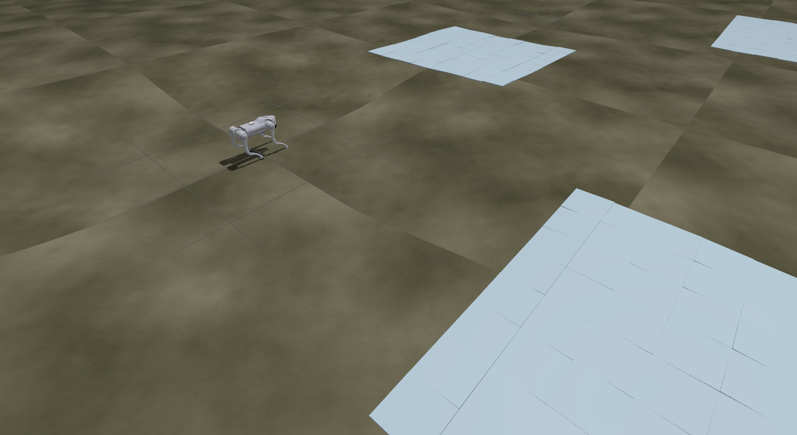
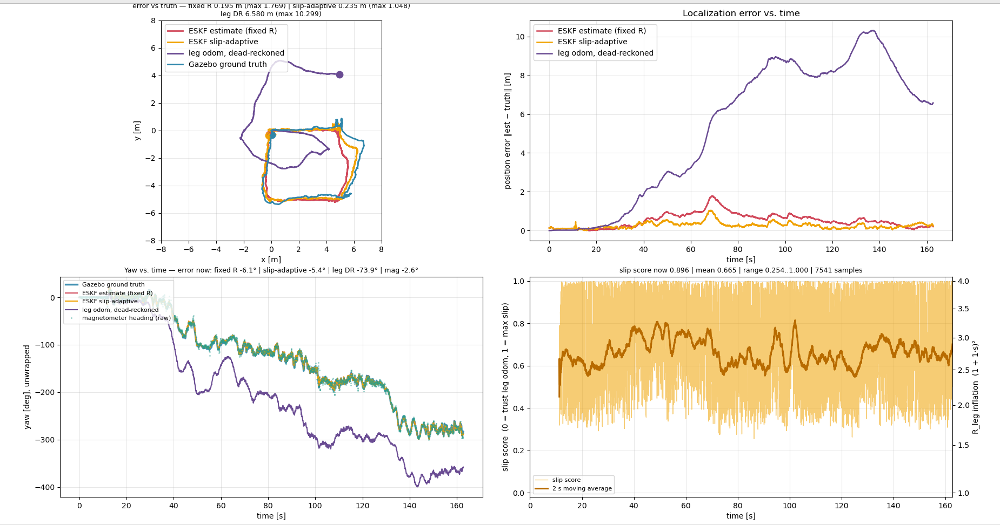

# Unitree Go2 ESKF localization (ROS 2 Jazzy)

A ROS 2 Jazzy workspace for simulating the Unitree Go2 quadruped in Gazebo Harmonic
and localizing it with **`go2_eskf`**, an 8-state error-state EKF that fuses
**IMU + leg odometry + GPS** (optionally magnetometer). It also has a
**slip-adaptive** leg-odometry covariance learned from logged runs.

One script (`run_go2_teleop.sh`) starts the sim, the estimators, keyboard teleop or an
autonomous square drift test, and a live plot. It then writes a report of the run.



*The Go2 in Gazebo on the terrain world (`--terrain`): an uneven heightmap with
low-friction slip patches (light blue) placed along the square route.*

## Repository layout

```
Rasp_jazz_wk/
├── build.sh               # build / test helper (always --merge-install --symlink-install)
├── run_go2_teleop.sh      # one-command sim + ESKF + teleop/square test + report
├── requirements.txt       # Python deps for the go2_eskf scripts
├── src/
│   ├── go2_eskf/          # the estimator (C++/Eigen core + ROS node + Python tooling)
│   │   ├── src/ include/  # eskf_core (ROS-free), eskf_node
│   │   ├── test/          # GTest: filter core + slip model
│   │   ├── scripts/       # plotting, square test, reports, slip training, terrain gen
│   │   ├── launch/        # eskf, ground_truth, benchmark
│   │   ├── config/        # eskf_params.yaml, slip_model.txt, stiff PD gains
│   │   ├── worlds/        # flat.sdf (default), terrain.sdf + heightmaps
│   │   └── docs/          # DESIGN, REFERENCE, SLOPE_POSTURE
│   └── unitree_go2_ros2/  # vendored Go2 description + CHAMP controller + Gazebo sim
├── run_report/            # (generated) latest run's REPORT.md, timeseries.csv, logs
└── slip_dataset/          # (generated) per-run slip feature logs for training
```

## Requirements

- Ubuntu 24.04
- ROS 2 Jazzy (`/opt/ros/jazzy`)
- Gazebo Sim Harmonic
- Python 3.12 with `numpy`, `matplotlib`, `Pillow` (see `requirements.txt`).
  PyTorch is optional: slip training falls back to NumPy without it.

The sim package's full apt dependency list is in
[`src/unitree_go2_ros2/README.md`](src/unitree_go2_ros2/README.md). `./build.sh --deps`
installs these through rosdep.

## Build

```bash
cd ~/Rasp_jazz_wk
./build.sh --clean --deps --test   # first time: fresh build, deps, tests
./build.sh                         # later: incremental build
./build.sh --pkg go2_eskf --test   # one package
source install/setup.bash
```

> The workspace **must** be built with `--merge-install`. The run script looks for
> files under `install/share/<pkg>/`. `build.sh` handles this for you. If you call colcon
> by hand and see *"install directory was created with the layout 'isolated'"*,
> run `./build.sh --clean`.

## Run

```bash
source install/setup.bash

./run_go2_teleop.sh                                # flat world, drive with i/j/k/l/, in the TELEOP window
./run_go2_teleop.sh --plot                         # + ground truth and live XY/error plot
./run_go2_teleop.sh --square                       # autonomous 5 m square drift test (auto-stops)
./run_go2_teleop.sh --terrain --adapt --mag --square
```

Stop everything with **Ctrl-C in the launching shell**, not in the child windows.

Common flags:

| Flag | Effect |
|---|---|
| `--plot` | ground-truth bridge + live plot (truth, baseline ESKF, slip-adaptive ESKF) |
| `--square` | autonomous square route instead of teleop; 300 s failsafe cap |
| `--terrain` | heightmap world with low-friction patches (`worlds/terrain.sdf`) |
| `--obstacles` | vendored world with boxes/cylinders |
| `--adapt` / `--stiff` / `--climb` | slope-adaptive posture / 3× joint PD gains / terrain + both |
| `--mag` | fuse magnetometer heading |
| `--no-gps` / `--no-slip` | drop GPS / run only the baseline estimator |
| `--rviz` / `--lite` / `--software-render` | load and rendering options |
| `--timeout N` / `--no-timeout` | wall-clock cap in seconds |
| `--no-report` / `--no-train` | skip the run report / post-run slip retrain |

The script header (`head -100 run_go2_teleop.sh`) documents every flag.

## Results

Autonomous 5 m square on the terrain world
(`./run_go2_teleop.sh --terrain --adapt --mag --square`, GPS and magnetometer fused):



| Estimator | Mean position error | Max position error | Final yaw error |
|---|---|---|---|
| ESKF, fixed leg covariance (`/eskf/odom`) | 0.195 m | 1.769 m | −6.1° |
| ESKF, slip-adaptive (`/eskf_slip/odom`) | 0.235 m | 1.048 m | −5.4° |
| Leg odometry alone (dead-reckoned) | 6.580 m | 10.299 m | −73.9° |

On a 30.5 m path, both filters stay within about 0.2 m of ground truth on average. Leg
odometry alone drifts more than 10 m. The slip-adaptive arm cuts the worst-case error by
about 40%, but its mean error is slightly higher; a single run isn't enough to say which is better.

- **Top left:** XY trajectory: ground truth, both ESKF arms, and dead-reckoned leg odometry.
- **Top right:** position error over time.
- **Bottom left:** yaw over time, including the raw magnetometer heading.
- **Bottom right:** the slip model's score (0 = trust leg odometry, 1 = maximum slip) and the
  resulting inflation of the leg-odometry covariance.

## Outputs

Each run **overwrites** `run_report/`:

- `REPORT.md`: configuration, outcome, stall detector, gait health, estimator error
  for both arms, topic rates, and node warnings/errors
- `timeseries.csv`: the trajectories behind the plot
- `node_logs/`, `slip_features.csv`, `slip_training.log`

The live plot is not saved automatically. Use the save button on the matplotlib toolbar
before the run ends. The file dialog opens in `~` by default.

## Estimator in brief

- **State:** position, velocity (ENU), yaw, yaw-rate gyro bias. Roll and pitch are inputs
  taken from gravity.
- **Predict:** IMU strapdown at ~100 Hz.
- **Correct:** leg-odometry body velocity, zero-velocity updates at standstill,
  vertical-velocity anchor, gyro bias (when not turning), GPS position, and optionally
  magnetometer yaw. All updates use the Joseph form.
- **Slip model:** a small MLP (trained in PyTorch or NumPy, run in Eigen) scales the
  leg-odometry covariance. A second estimator instance runs it side by side with the
  fixed-covariance baseline, so every run is an A/B comparison.
- **Outputs:** `/eskf/odom` (baseline) and `/eskf_slip/odom` (slip-adaptive).

The full derivation, with file and line references, is in
[`src/go2_eskf/README.md`](src/go2_eskf/README.md). The design notes are in
[`src/go2_eskf/docs/`](src/go2_eskf/docs/).

## Troubleshooting

- **Gazebo segfaults on start (Optimus laptop):** the script forces the NVIDIA GPU.
  If it still crashes, use `--software-render`.
- **Position estimate runs away:** check the ESKF window for the
  `First /odom/raw ... received` and `First /gps/fix ... received` lines. If one is
  missing, that input isn't reaching the filter.
- **`world not found ... install/share/...`:** the workspace was built without
  `--merge-install`. Run `./build.sh --clean`.

## Credits

The Go2 simulation in `src/unitree_go2_ros2` (robot description, CHAMP controller,
Gazebo launch and configs) is borrowed from
**[khaledgabr77/unitree_go2_ros2](https://github.com/khaledgabr77/unitree_go2_ros2)**
by Khaled Gabr, vendored at upstream commit
[`497409c`](https://github.com/khaledgabr77/unitree_go2_ros2/commit/497409c31e2f54cd5b1a84cb5a0be62fb7e86829)
(Apr 29, 2026). That commit includes the simulated GPS sensor contributed by
Mohamed Abdelkader. Thank you to them for making it available.

That project in turn builds on:

- [Unitree Robotics — unitree_ros](https://github.com/unitreerobotics/unitree_ros): Go2 robot description (URDF)
- [CHAMP](https://github.com/chvmp/champ) by Juan Miguel Jimeno: quadruped controller framework
- [CHAMP Robots](https://github.com/chvmp/robots): robot configurations
- [anujjain-dev/unitree-go2-ros2](https://github.com/anujjain-dev/unitree-go2-ros2): earlier ROS 2 / Gazebo Classic Go2 package

This workspace makes a few local edits to the vendored code, such as adding a
magnetometer sensor on `imu_link`. The upstream README's License section is empty, and
CHAMP's packages are BSD, so check the upstream repositories before redistributing that
code. `go2_eskf` is MIT licensed.
